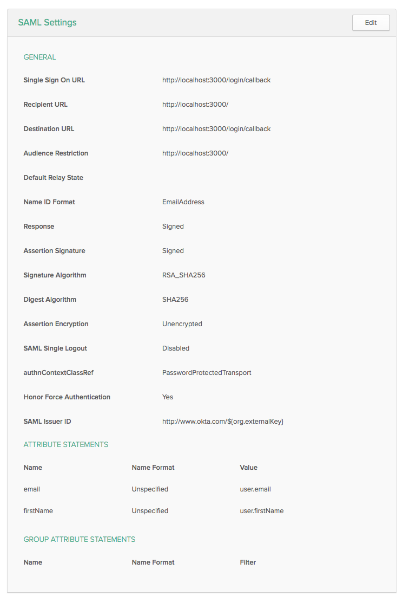

## Overview

a newer version of [okta-node-express](https://github.com/ThoughtWorksInc/okta-samples/tree/master/okta-node-express)

This application shows how to protect your application using Okta. Packages passport and passport-saml and are used to handle the SAML authentication and connect was used to compress the requests from the node server.

The idea is only to show how to integrate and what options to provide when configuring Okta. Please follow best practices for securing your application like setting a random secure token for session etc.

You need the X509 cert string and target url from Okta. Config them in config.json You can get these details from the Okta team when you ask them to configure you application in Okta.

## References

I had to install Shibboleth on our windows 2012 server and I followed this [wiki](https://wiki.shibboleth.net/confluence/display/SHIB2/NativeSPWindowsInstall)

I fast forward to 4:15 for Saml [Okta app video](https://support.okta.com/help/articles/Knowledge_Article/Adding-Applications-Using-the-Application-Integration-Wizard-AIW)

## Setup

```
npm install
```

## Run

```
npm start
```

## Okta SAML setup


